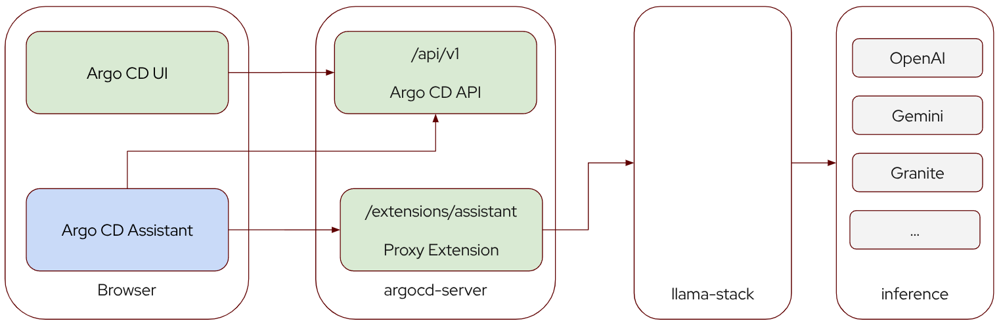
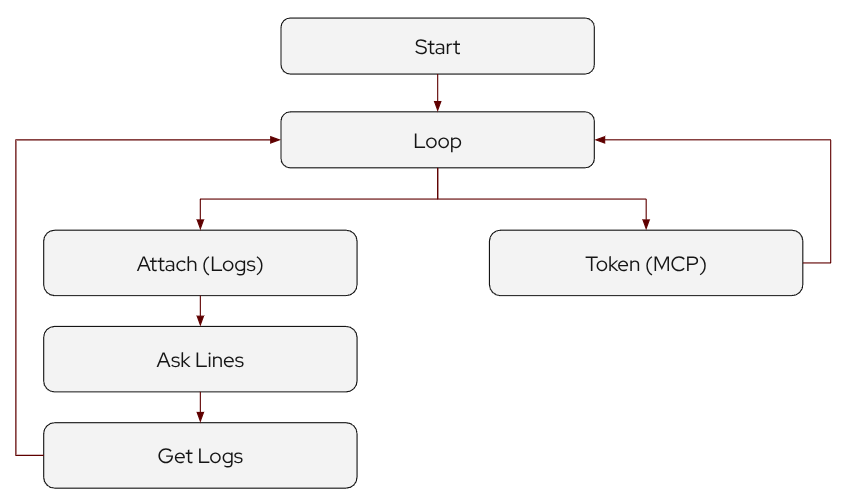

### Introduction

Argo CD enables extending the User Interface (UI) it provides via an
[extension](https://argo-cd.readthedocs.io/en/latest/developer-guide/extensions/ui-extensions/) mechanism.
The Assistant for Argo CD uses the
[Resource Tab Extension](https://argo-cd.readthedocs.io/en/latest/developer-guide/extensions/ui-extensions/#resource-tab-extensions) to provide
an additional tab on the Resource slide-out that appears when a Resource is clicked in the UI.

To provide the query functionality the Assistant supports one of two providers for interfacing with various inference providers:

1. [Llama-Stack](https://llamastack.github.io/) - LLama-Stack was a project started by Meta with the goal
 to provide a unified API for various inference and tool providers.
2. [Lightspeed](https://www.redhat.com/en/technologies/cloud-computing/openshift/lightspeed) - A Red Hat project that is included
as an Operator in Red Hat OpenShift. Originally it was a separate code base but recently has moved to Llama-Stack, however it still
maintains the previous API which is what this provider interfaces with.

It was a conscious decision when creating this tool to focus on back-ends that provide unified APIs rather then attempt to interface
with each model provider (OpenAI, Gemini, Granite, etc) individually. This offloads the maintenance of inference APIs to the back-end
open source projects. Additionally these back-ends also integrate with Model Context Protocol (MCP) tools which is planned for the
future of this extension.

### Architecture

The architecture and communication channels the extension utilizes are as per the diagram below:

Argo CD leverages Cross-Origin Resource Sharing (CORS) to prevent malicious extensions or code from
communicating outside of the domain being used for the UI. In order to communicate with the back-end
the extension leverages the Argo CD [Proxy Extension](https://argo-cd.readthedocs.io/en/stable/developer-guide/extensions/proxy-extensions/) to do so.

The Proxy Extension enables traffic intended for the back-end such as LLama-Stack to be proxied through the argocd-server pod fulfilling CORs
requirements. To support streaming responses, the extension sets the content-length header for requests to -1, this informs the Go Proxy
to immediately stream responses rather then buffer them.

### Query Context

The Assistant provides additional context when queries are sent to the back-end and on to the inference provider.

1. Resource Manifest. The live resource manifest is provided to enable queries, this manifest is provided by
Argo CD automatically when the extension is invoked.
2. Events. The Assistant will automatically retrieve the resource Events and attach them to the context. The
Events are currently cached and are not continuously updated.
3. Logs (Optional). If the resource supports logs, a log file from a single container can be attached to the
context via a guided conversation flow. Once attached the logs are cached and provided on every request, logs
can be re-fetched by initiating the flow again.

!!! note
    It's important to note that most inference providers support a limited amount of tokens. As a result larger
    context items might exhaust the query token limit.

### Chatbot Interface

This extension uses the [React ChatBotify](https://react-chatbotify.com/) React component for the chat interface.
This component provides support for a variety of features including streaming, markdown rendering and more.

Following the architecture of React ChatBotify the Assistant Extension defines a conversation flow as follows:

1. When the user first interacts with the Assistant they begin at the Start node. Here the Assistant provides
a starting message including some information about the resource like Kind and Name. Optionally if
the resource is of a type that supports Logs it will include a message on how to being the Attach Logs
guided conversation flow.
2. After the Start node, the user enters the Loop Node where they can enter queries. The Loop Node, as the name
implies, loops on itself after every query. Users can opt to go to other folks by entering a keyword.
3. Entering the `attach` keyword will start the Attach Logs guided conversation flow. The Chatbot will prompt
the user with a list of containers from which they can select one container for which to attach logs. Next they
are prompted to select the number of lines to attach to maximum configurable limit.
4. (In Development) If the MCP feature flag is enabled (off by default), a Token flow can be initiated
by the user to provide an Argo CD token that an MCP server, such as
[mcp-for-argocd](https://github.com/argoproj-labs/mcp-for-argocd), can use to interact with Argo CD. This flow
is temporary to develop MCP integration and will be removed at a later date once token passing issues are resolved.

While React ChatBotify does have direct support for LLM providers these are not used as additional features
were needed over and above what the component provided such as attaching context.
